# 🔌 Arquitetura Backend

## 🏗️ Estrutura NestJS

O backend utiliza **NestJS** com arquitetura modular e padrões enterprise para máxima escalabilidade.


## 🔄 Fluxo de Requisição

### **Request Lifecycle**

```mermaid
sequenceDiagram
    participant C as 🌐 Client
    participant G as 🛡️ Guards
    participant I as 🔍 Interceptors
    participant P as 🔧 Pipes
    participant Ctrl as 🎮 Controller
    participant Svc as ⚙️ Service
    participant D as 💾 Data Layer
    
    C->>G: HTTP Request
    G->>G: Authentication Check
    
    alt ✅ Authenticated
        G->>I: Forward Request
        I->>I: Request Logging
        I->>P: Transform Request
        P->>P: Validation & Transformation
        P->>Ctrl: Validated Data
        
        Ctrl->>Svc: Business Logic Call
        Svc->>D: Data Operations
        D-->>Svc: Data Response
        Svc-->>Ctrl: Processed Data
        
        Ctrl-->>P: Response Data
        P-->>I: Transformed Response
        I->>I: Response Logging
        I-->>G: Final Response
        G-->>C: HTTP Response
    else ❌ Unauthorized
        G-->>C: 401 Unauthorized
    end
```


## 🎯 Padrões de Design

### **Dependency Injection Pattern**

```mermaid
graph TB
    subgraph "🏭 IoC Container"
        Container[NestJS IoC Container]
    end
    
    subgraph "🎮 Controllers"
        AuthCtrl[AuthController]
        AnalysisCtrl[AnalysisController]
        SimulatorCtrl[SimulatorController]
    end
    
    subgraph "⚙️ Services"
        AuthSvc[AuthService]
        AnalysisSvc[AnalysisService]
        SimulatorSvc[SimulatorService]
        LoggerSvc[LoggerService]
        ConfigSvc[ConfigService]
    end
    
    subgraph "💾 Repositories"
        UserRepo[UserRepository]
        DataRepo[DataRepository]
        FileRepo[FileRepository]
    end
    
    Container -.->|Inject| AuthCtrl
    Container -.->|Inject| AnalysisCtrl
    Container -.->|Inject| SimulatorCtrl
    
    Container -.->|Inject| AuthSvc
    Container -.->|Inject| AnalysisSvc
    Container -.->|Inject| SimulatorSvc
    Container -.->|Inject| LoggerSvc
    Container -.->|Inject| ConfigSvc
    
    AuthCtrl --> AuthSvc
    AnalysisCtrl --> AnalysisSvc
    SimulatorCtrl --> SimulatorSvc
    
    AuthSvc --> UserRepo
    AuthSvc --> LoggerSvc
    AnalysisSvc --> DataRepo
    AnalysisSvc --> ConfigSvc
    SimulatorSvc --> FileRepo
    
    classDef container fill:#ffebee,stroke:#c62828,color:#000
    classDef controller fill:#e8f5e8,stroke:#2e7d32,color:#000
    classDef service fill:#e3f2fd,stroke:#1976d2,color:#000
    classDef repository fill:#fff3e0,stroke:#f57c00,color:#000
    
    class Container container
    class AuthCtrl,AnalysisCtrl,SimulatorCtrl controller
    class AuthSvc,AnalysisSvc,SimulatorSvc,LoggerSvc,ConfigSvc service
    class UserRepo,DataRepo,FileRepo repository
```


## 🛡️ Middleware Pipeline

### **Security & Validation Pipeline**

```mermaid
graph LR
    subgraph "🌐 Incoming Request"
        Request[HTTP Request]
    end
    
    subgraph "🔒 Security Layer"
        CORS[CORS Middleware]
        Helmet[Helmet Security]
        RateLimit[Rate Limiting]
    end
    
    subgraph "🔍 Processing Layer"
        Logger[Request Logger]
        Parser[Body Parser]
        Validator[Validation Pipe]
    end
    
    subgraph "🎯 Business Layer"
        Guard[Auth Guard]
        Controller[Route Handler]
        Service[Business Logic]
    end
    
    subgraph "📤 Response"
        Transform[Transform Interceptor]
        Response[HTTP Response]
    end
    
    Request --> CORS
    CORS --> Helmet
    Helmet --> RateLimit
    
    RateLimit --> Logger
    Logger --> Parser
    Parser --> Validator
    
    Validator --> Guard
    Guard --> Controller
    Controller --> Service
    
    Service --> Transform
    Transform --> Response
    
    classDef security fill:#ffebee,stroke:#c62828,color:#000
    classDef processing fill:#e8f5e8,stroke:#2e7d32,color:#000
    classDef business fill:#e3f2fd,stroke:#1976d2,color:#000
    classDef response fill:#fff3e0,stroke:#f57c00,color:#000
    
    class CORS,Helmet,RateLimit security
    class Logger,Parser,Validator processing
    class Guard,Controller,Service business
    class Transform,Response response
```


## 📊 Estrutura de Dados

### **Data Flow Architecture**
```mermaid
graph TB
    subgraph "🔌 API Endpoints"
        AuthAPI[/auth/login]
        AnalysisAPI[/analysis/*]
        SimulatorAPI[/simulator/*]
        ReportsAPI[/reports/*]
        UploadAPI[/upload/*]
    end
    
    subgraph "⚙️ Business Services"
        AuthSvc[Authentication Service]
        AnalysisSvc[Analysis Service]
        SimulatorSvc[Simulator Service]
        ReportsSvc[Reports Service]
        UploadSvc[Upload Service]
    end
    
    subgraph "💾 Data Sources"
        MockData[Mock Data Store]
        FileSystem[File System]
        MemoryCache[In-Memory Cache]
    end
    
    subgraph "📋 Data Models"
        UserModel[User Model]
        NetworkModel[Network Model]
        SimulationModel[Simulation Model]
        ReportModel[Report Model]
    end
    
    AuthAPI --> AuthSvc
    AnalysisAPI --> AnalysisSvc
    SimulatorAPI --> SimulatorSvc
    ReportsAPI --> ReportsSvc
    UploadAPI --> UploadSvc
    
    AuthSvc --> MockData
    AuthSvc --> UserModel
    
    AnalysisSvc --> MockData
    AnalysisSvc --> MemoryCache
    AnalysisSvc --> NetworkModel
    
    SimulatorSvc --> FileSystem
    SimulatorSvc --> SimulationModel
    
    ReportsSvc --> MockData
    ReportsSvc --> ReportModel
    
    UploadSvc --> FileSystem
    
    classDef api fill:#e8f5e8,stroke:#2e7d32,color:#000
    classDef service fill:#e3f2fd,stroke:#1976d2,color:#000
    classDef data fill:#fff3e0,stroke:#f57c00,color:#000
    classDef model fill:#f3e5f5,stroke:#7b1fa2,color:#000
    
    class AuthAPI,AnalysisAPI,SimulatorAPI,ReportsAPI,UploadAPI api
    class AuthSvc,AnalysisSvc,SimulatorSvc,ReportsSvc,UploadSvc service
    class MockData,FileSystem,MemoryCache data
    class UserModel,NetworkModel,SimulationModel,ReportModel model
```

## 🔐 Sistema de Autenticação

### **Authentication Flow**


### **JWT Token Management**

```mermaid
graph LR
    subgraph "🔐 Auth Process"
        Login[Login Request]
        Validate[Validate Credentials]
        Generate[Generate JWT]
        Response[Auth Response]
    end
    
    subgraph "🎫 Token Structure"
        Header[Header: Algorithm]
        Payload[Payload: User Data]
        Signature[Signature: Secret]
    end
    
    subgraph "🛡️ Protection"
        Guard[JWT Guard]
        Verify[Verify Token]
        Extract[Extract User]
        Authorize[Authorize Request]
    end
    
    Login --> Validate
    Validate --> Generate
    Generate --> Response
    
    Generate --> Header
    Generate --> Payload
    Generate --> Signature
    
    Guard --> Verify
    Verify --> Extract
    Extract --> Authorize
    
    classDef auth fill:#ffebee,stroke:#c62828,color:#000
    classDef token fill:#e8f5e8,stroke:#2e7d32,color:#000
    classDef protection fill:#e3f2fd,stroke:#1976d2,color:#000
    
    class Login,Validate,Generate,Response auth
    class Header,Payload,Signature token
    class Guard,Verify,Extract,Authorize protection
```


## 📁 Sistema de Upload

### **File Upload Process**


## 🔧 Configuração e Environment

### **Configuration Management**

```mermaid
graph TB
    subgraph "⚙️ Config Sources"
        EnvFile[.env files]
        ProcessEnv[process.env]
        DefaultConfig[default.config.ts]
    end
    
    subgraph "🔧 Config Service"
        ConfigModule[ConfigModule]
        ConfigService[ConfigService]
        Validation[Config Validation]
    end
    
    subgraph "📦 Module Injection"
        AuthModule[Auth Module]
        DatabaseModule[Database Module]
        UploadModule[Upload Module]
    end
    
    EnvFile --> ConfigModule
    ProcessEnv --> ConfigModule
    DefaultConfig --> ConfigModule
    
    ConfigModule --> ConfigService
    ConfigService --> Validation
    
    Validation --> AuthModule
    Validation --> DatabaseModule
    Validation --> UploadModule
    
    classDef source fill:#ffebee,stroke:#c62828,color:#000
    classDef config fill:#e8f5e8,stroke:#2e7d32,color:#000
    classDef module fill:#e3f2fd,stroke:#1976d2,color:#000
    
    class EnvFile,ProcessEnv,DefaultConfig source
    class ConfigModule,ConfigService,Validation config
    class AuthModule,DatabaseModule,UploadModule module
```


---

**Próximo:** [Fluxo de Dados →](./data-flow.md)

