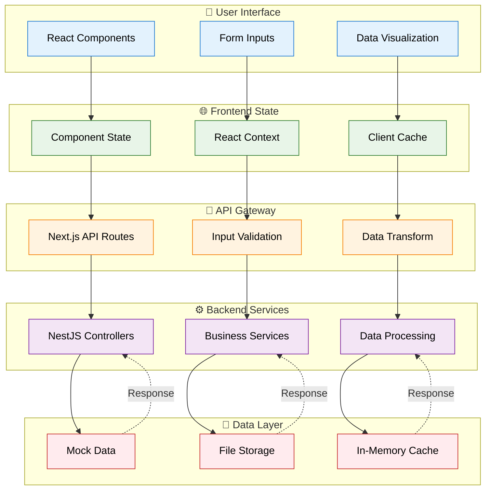
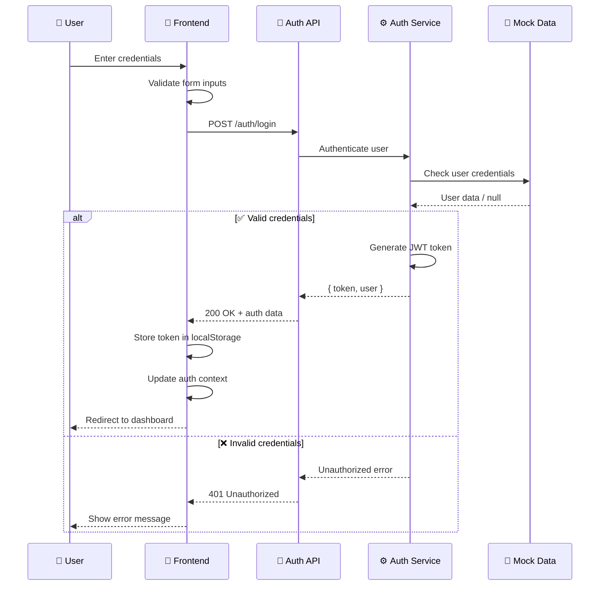
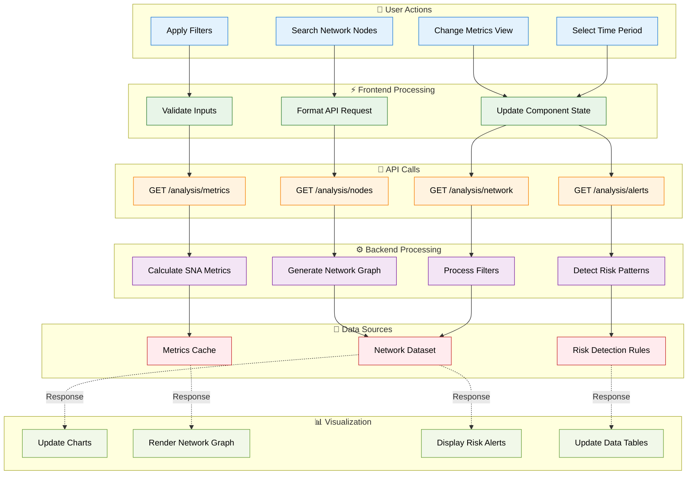
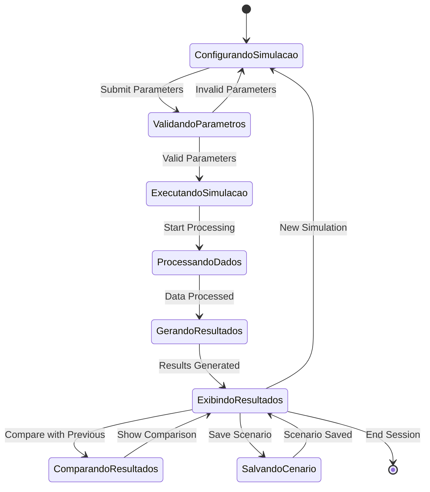
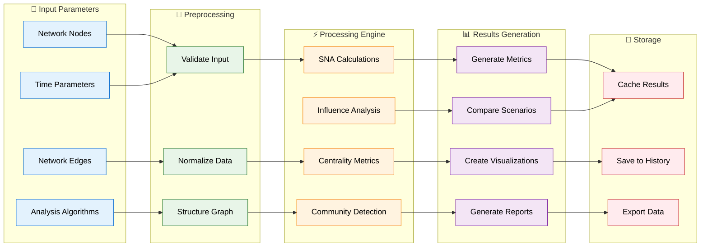
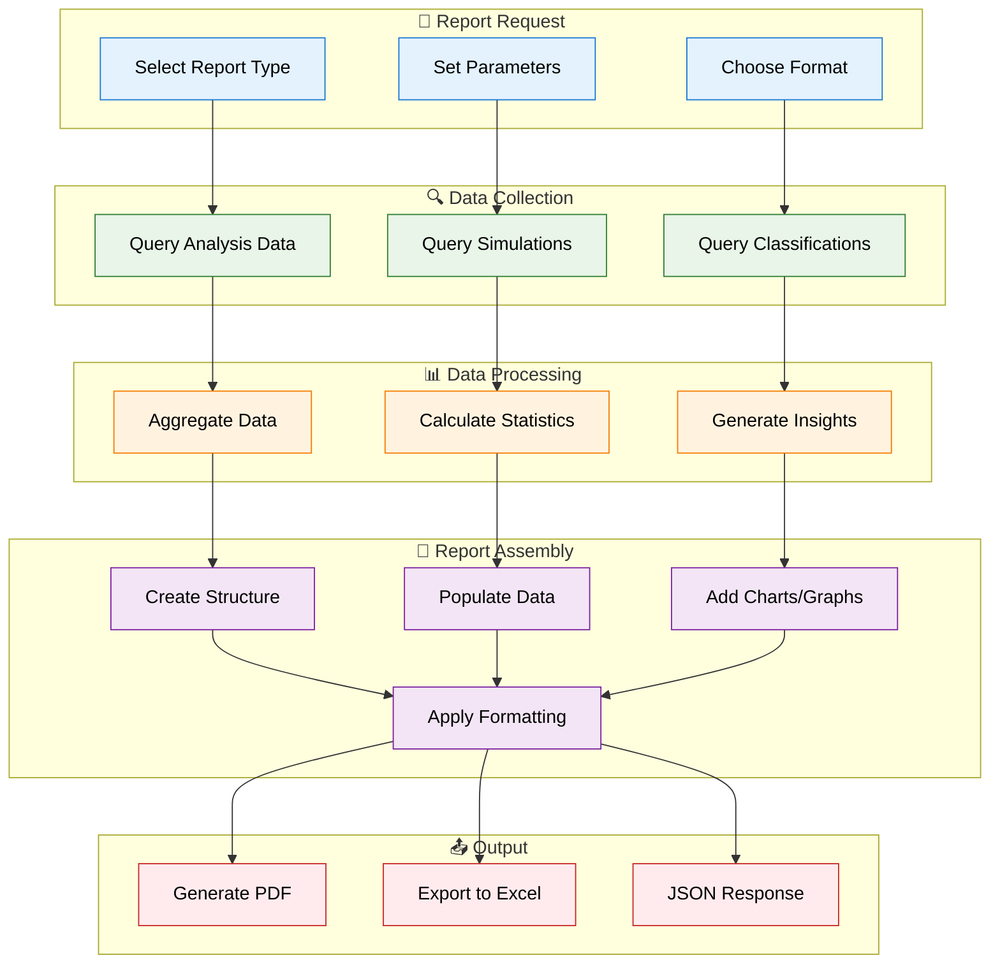
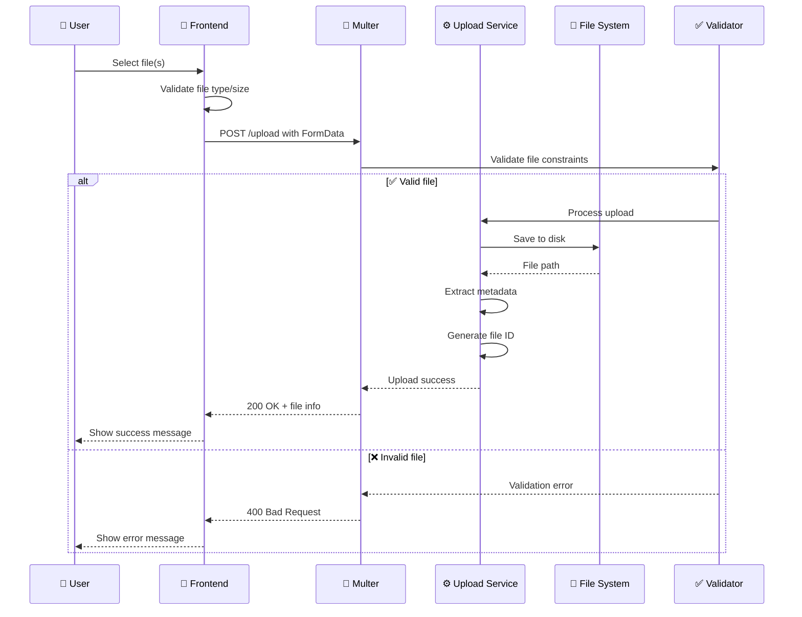
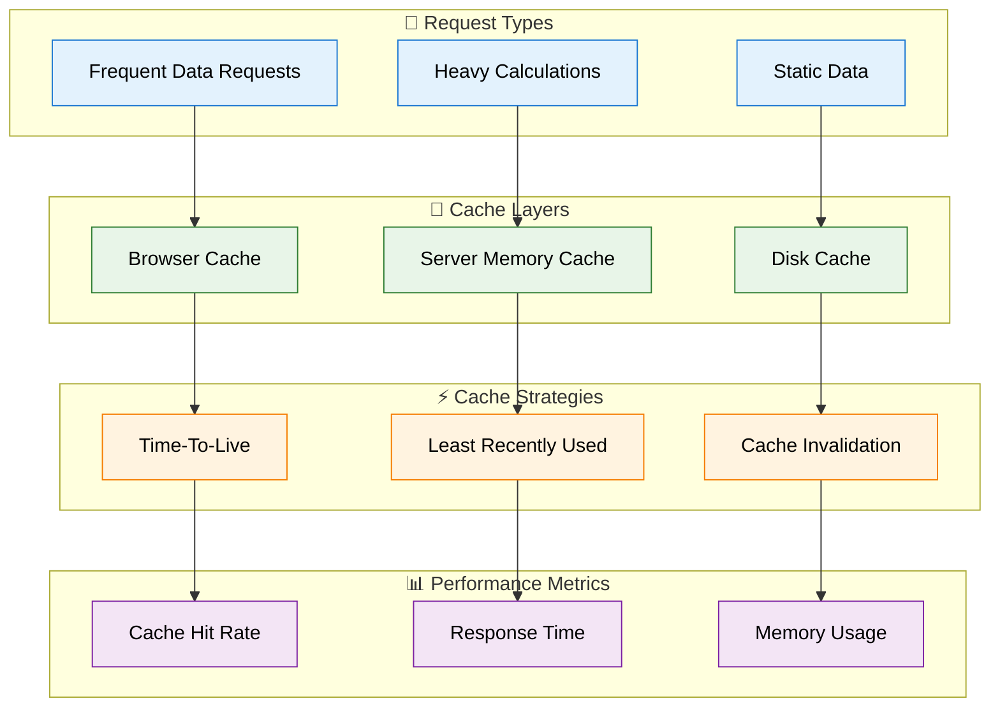

# 🔄 Fluxo de Dados

## 📊 Visão Geral do Fluxo

O sistema **Strato PJ** processa dados de análise de redes sociais através de múltiplas camadas, desde a entrada do usuário até a visualização dos resultados.

## 🔐 Fluxo de Autenticação

### **Authentication Data Flow**

## 📈 Fluxo de Análise de Dados

### **Network Analysis Data Flow**

## 🎯 Fluxo de Simulação

### **Simulation Data Flow**

### **Simulation Processing Pipeline**

## 📋 Fluxo de Relatórios

### **Report Generation Flow**

## 📁 Fluxo de Upload de Arquivos

### **File Upload Data Flow**

## 🔄 Cache e Performance

### **Caching Strategy**

---

**Próximo:** [Documentação da API →](../api/endpoints.md)

