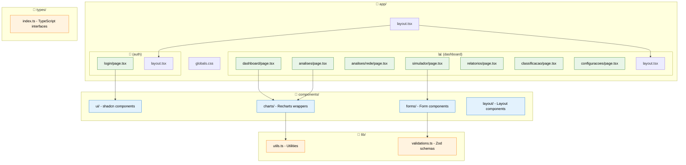
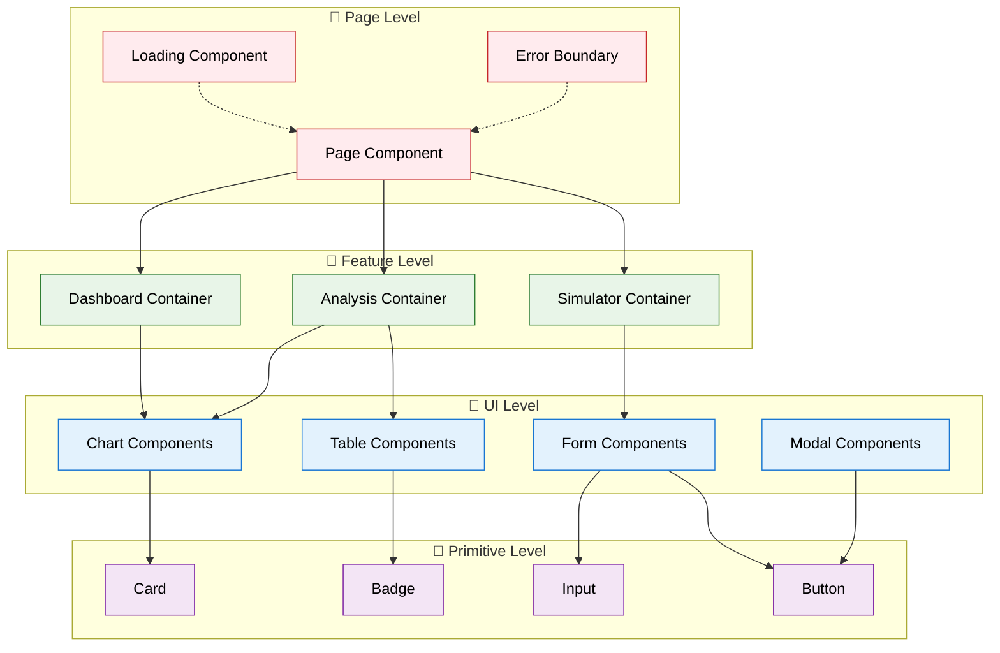
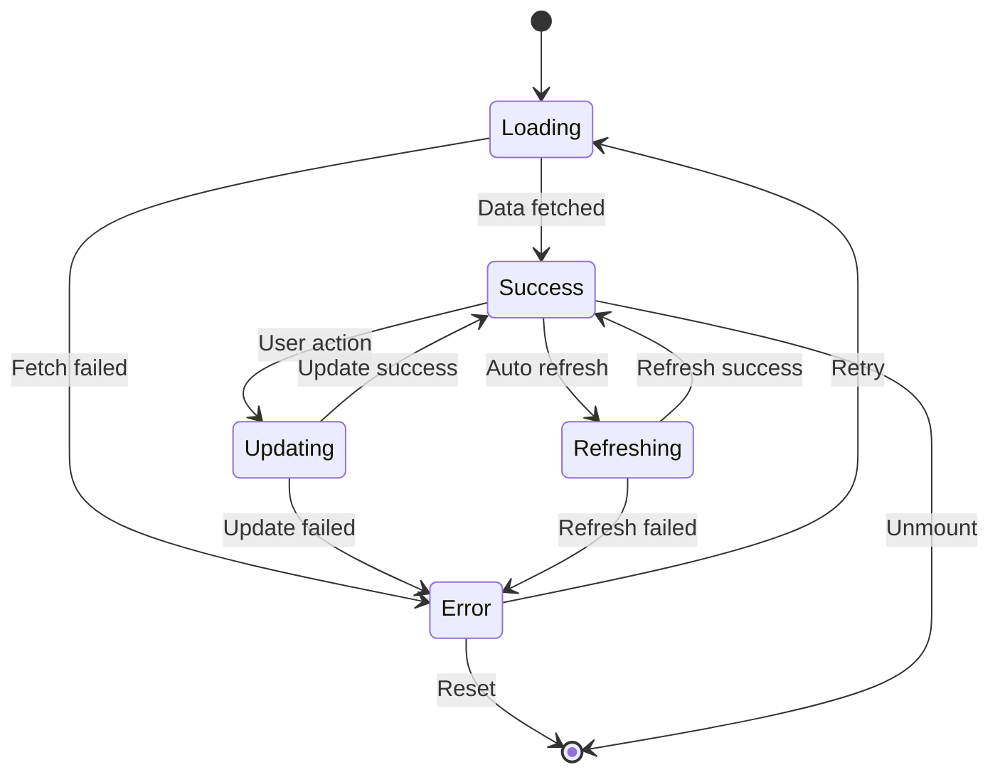
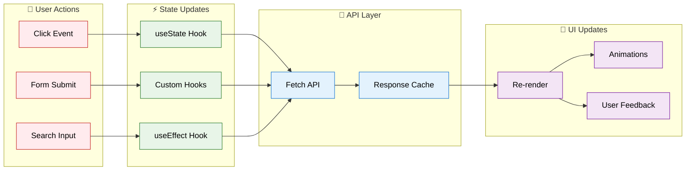
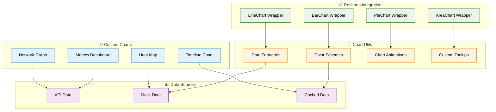
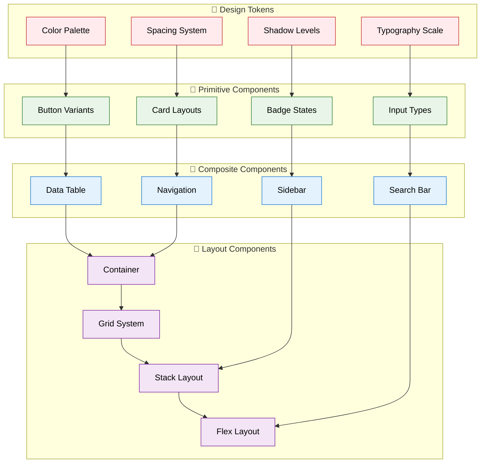
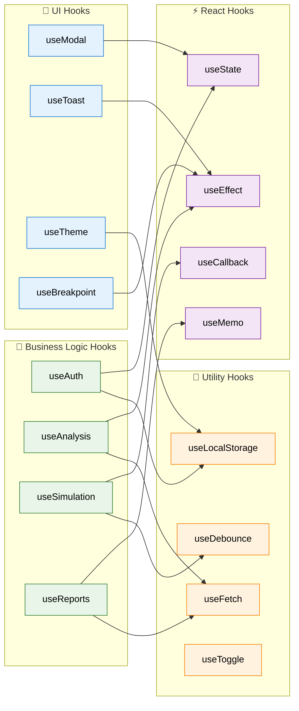
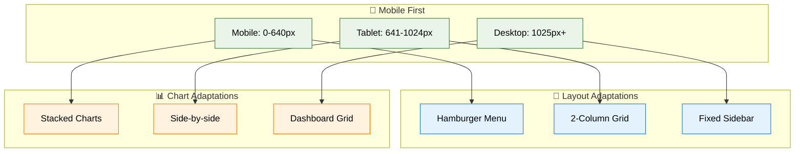

# 🎨 Arquitetura Frontend

## 🏗️ Estrutura Next.js 15

O frontend utiliza **Next.js 15** com **App Router** para uma arquitetura moderna e performática.

## 🎯 Padrões de Componentes

### **Component Hierarchy**

## 🔄 Fluxo de Estados

### **State Management Pattern**

### **Component State Flow**

## 📊 Componentes de Visualização

### **Chart Components Architecture**

## 🎨 Design System

### **Component Library Structure**

## 🔧 Hooks Customizados

### **Custom Hooks Pattern**

## 📱 Responsividade

### **Breakpoint Strategy**

---

**Próximo:** [Arquitetura Backend →](./backend.md)

