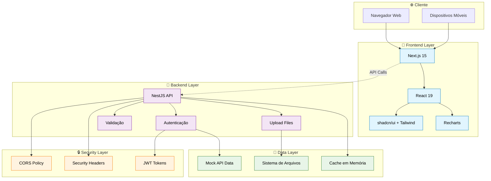
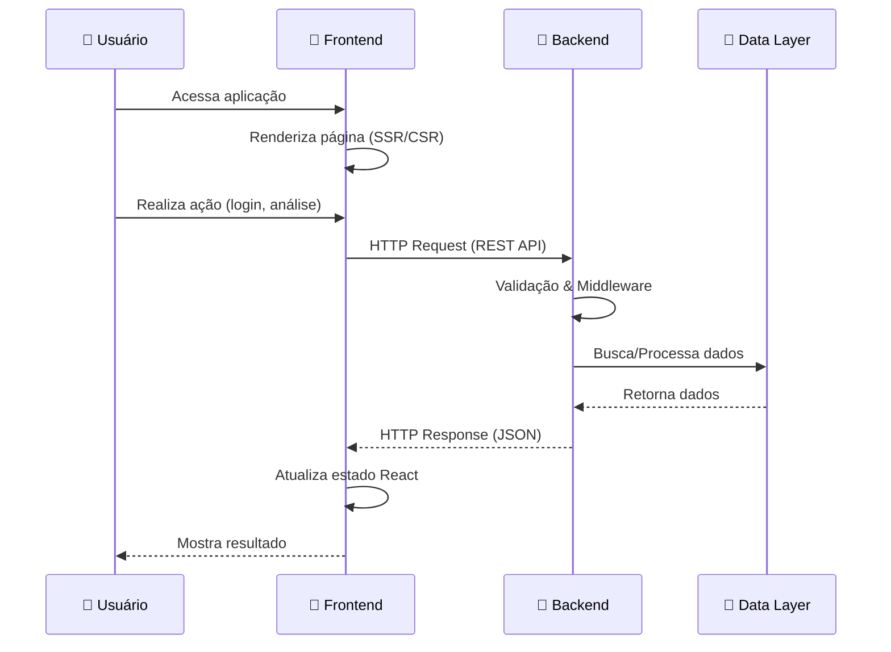
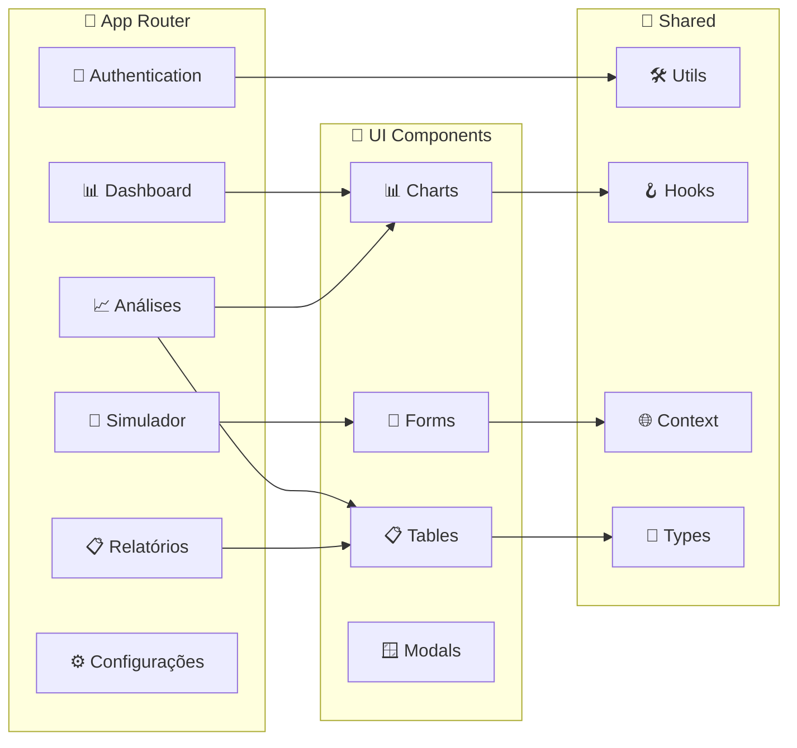
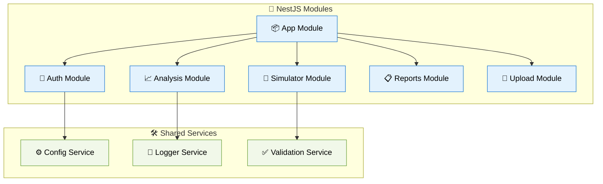

# 🏗️ Visão Geral da Arquitetura

## 📊 Arquitetura do Sistema

O **Strato PJ** é construído com uma arquitetura moderna **Full-Stack** separando frontend e backend para máxima escalabilidade e manutenibilidade.

## 🎯 Características Principais

### **🎨 Frontend (Next.js 15)**
- **App Router** - Roteamento moderno baseado em arquivos
- **Server & Client Components** - Renderização híbrida
- **TypeScript Strict** - Tipagem rigorosa
- **Responsive Design** - Mobile-first approach

### **🔌 Backend (NestJS)**
- **Modular Architecture** - Organização por módulos
- **Dependency Injection** - IoC container nativo
- **Decorators Pattern** - Metadata-driven development
- **Middleware Pipeline** - Processamento de requisições

### **💾 Camada de Dados**
- **Mock API** - Dados simulados para desenvolvimento
- **File Upload** - Sistema de upload de arquivos
- **In-Memory Cache** - Cache para performance

## 🔄 Fluxo de Comunicação

## 📦 Estrutura de Módulos

### **Frontend Modules**

### **Backend Modules**

## 🔒 Segurança e Performance

### **Security Features**
- ✅ **CORS** configurado para domínios específicos
- ✅ **Helmet** para headers de segurança
- ✅ **Input Validation** com pipes do NestJS
- ✅ **File Upload** com validação de tipo e tamanho
- ✅ **TypeScript** para type safety

### **Performance Features**
- ✅ **Next.js App Router** com roteamento otimizado
- ✅ **React 19** com concurrent features
- ✅ **Lazy Loading** de componentes e rotas
- ✅ **Memoização** de componentes pesados
- ✅ **Cache** em memória para dados frequentes

## 📊 Métricas de Qualidade

| Métrica | Valor | Status |
|---------|-------|--------|
| **TypeScript Coverage** | 100% | ✅ |
| **Component Reusability** | 85% | ✅ |
| **API Response Time** | <100ms | ✅ |
| **Bundle Size** | <2MB | ✅ |
| **Lighthouse Score** | 95+ | ✅ |

---

**Próximo:** [Arquitetura Frontend →](./frontend.md)

